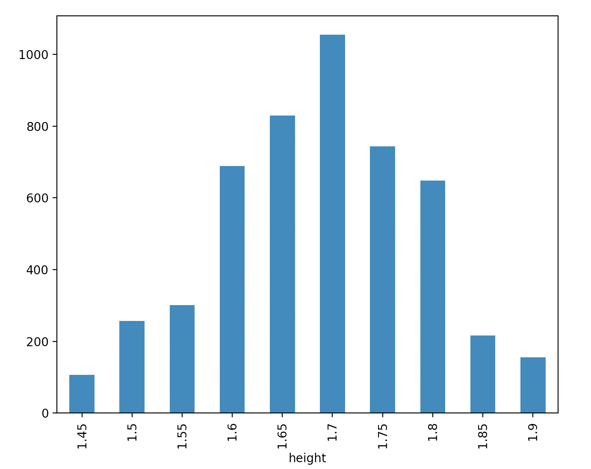
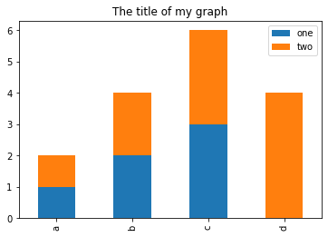
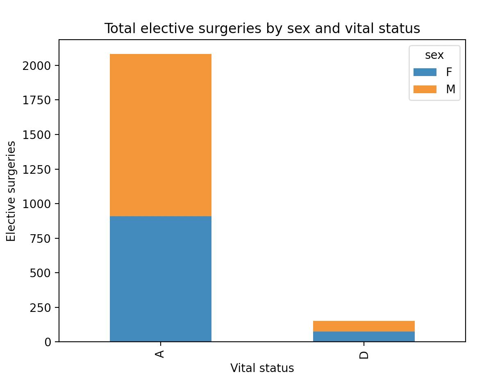

# Working With Pandas DataFrames in Python

We can automate the process of performing data manipulations in Python. It's efficient to spend time
building the code to perform these tasks because once it's built, we can use it
over and over on different datasets that use a similar format. This makes our
methods easily reproducible. We can also easily share our code with colleagues
and they can replicate the same analysis.

### Starting in the same spot

To help the lesson run smoothly, let's ensure everyone is in the same directory.
This should help us avoid path and file name issues. At this time please
navigate to the workshop directory. If you are working in IPython Notebook be sure
that you start your notebook in the workshop directory.

A quick aside that there are Python libraries like [OS Library][os-lib] that can work with our
directory structure, however, that is not our focus today.

### Our Data

For this course, we will be using data from the [Critical Care Health Informatics Collaborative (CC-HIC)](https://github.com/CC-HIC), a UK research body that has aggregated data from thousands of critical care patients. The data we will use takes an anonymised sample from this cohort and is available in the **`data/`** directory. For a full description of the data that exists inside CC-HIC see [here](https://docs.ropensci.org/cleanEHR/articles/cchic_overview.html) and [here](https://github.com/ropensci/cleanEHR/wiki/Data-set-1.0).

You are also encouraged to try out the following lessons with your own data after the course!

This section will use the `synthetic_data_clean.csv` file.
The data has been pre-prepared for us today, and will be presented as two “spreadsheets”. The dataset is stored as a `.csv` file: each row holds information for a single patient and the columns represent each variable.

The first few rows of our first file look like this:

~~~
ph_abg,hco3_abg,temp_c,temp_nc,urea,creatinine,na,k,hb,wbc,neutrophil,platelets,crp,chemo,chronic_rrt,metastatic,radiotx,apache,medical,system,height,weight,elective_surgical,arrival_dttm,discharge_dttm,dob,vital_status,sex,id,lactate_1hr,lactate_6hr,lactate_12hr
7.44,28,36.9,37.1,3,80 micromol/L,135,4.2,90,9.6,7.35,295,240.3,0,0,0,0,6,0,3,1.65,65,1,2014-01-01T13:06:16Z,2014-01-02T01:06:16Z,1964-01-01,A,F,00001,1.2,0.3,0.1
7.3,20.2,36.6,36.4,5.8,93 micromol/L,140,4.4,118,11.5,9.25,145,85,1,1,1,1,8,0,2,1.8,50,1,2014-01-01T00:35:32Z,2014-01-05T00:35:32Z,1984-01-01,A,M,00002,1.8,0.5,0.3
7.48,24.6,37.2,36.2,4.5,75 micromol/L,140,3.8,113,12.4,11.5,211,12,1,1,1,1,15,1,3,1.7,70,0,2014-01-01T01:24:13Z,2014-01-05T13:24:13Z,1964-01-01,A,F,00003,1.4,1.7,1.2
~~~
{: .output}
---

## About Libraries
A library in Python contains a set of tools (called functions) that perform
tasks on our data. Importing a library is like getting a piece of lab equipment
out of a storage locker and setting it up on the bench for use in a project.
Once a library is set up, it can be used or called to perform the task(s)
it was built to do.

## Pandas in Python
One of the best options for working with tabular data in Python is to use the Python Data Analysis Library [pandas][pandas]. The
pandas library provides data structures, produces high quality plots with the
[matplotlib][matplotlib] library and integrates nicely with other several other Python data analysis libraries.

Python doesn't load all of the libraries available to it by default. We have to
add an `import` statement to our code in order to use library functions. To import
a library, we use the syntax `import libraryName`. If we want to give the
library a nickname to shorten the command, we can add `as nickNameHere`.  An
example of importing the pandas library using the common nickname `pd` is below.

~~~
import pandas as pd
~~~
{: .language-python}

Each time we call a function that's in a library, we use the syntax
`LibraryName.FunctionName`. Adding the library name with a `.` before the
function name tells Python where to find the function. In the example above, we
have imported Pandas as `pd`. This means we don't have to type out `pandas` each
time we call a Pandas function.

# Reading CSV Data Using Pandas

We will begin by locating and reading our patient data which are in CSV format. CSV stands for
Comma-Separated Values and is a common way to store formatted data. Other symbols may also be used, so
you might see tab-separated, colon-separated or space separated files. It is quite easy to replace
one separator with another, to match your application. The first line in the file often has headers
to explain what is in each column. CSV (and other separators) make it easy to share data, and can be
imported and exported from many applications, including Microsoft Excel. For more details on CSV
files, see the [Data Organisation in Spreadsheets][spreadsheet-lesson5] lesson.
We can use the pandas `read_csv` function to pull the file directly into a [DataFrame][pd-dataframe].

## So What's a DataFrame?

A DataFrame is a 2-dimensional data structure that can store data of different
types (including characters, integers, floating point values, factors and more)
in columns. It is similar to a spreadsheet or an SQL table or the `data.frame` in
R. A DataFrame always has an index (0-based). An index refers to the position of
an element in the data structure.

~~~
# Note that pd.read_csv is used because we imported pandas as pd
pd.read_csv("data/synthetic_data_clean.csv")
~~~
{: .language-python}

The above command yields the **output** below:

~~~
      ph_abg  hco3_abg  temp_c  temp_nc  urea      creatinine   na  ...         dob  vital_status  sex    id  lactate_1hr  lactate_6hr  lactate_12hr
0       7.44      28.0    36.9     37.1   3.0   80 micromol/L  135  ...  1964-01-01             A    F     1          1.2          0.3           0.1
1       7.30      20.2    36.6     36.4   5.8   93 micromol/L  140  ...  1984-01-01             A    M     2          1.8          0.5           0.3
2       7.48      24.6    37.2     36.2   4.5   75 micromol/L  140  ...  1964-01-01             A    F     3          1.4          1.7           1.2
3       7.33      22.3    35.4     35.8  13.7  173 micromol/L  136  ...  1944-01-01             A    M     4          1.5          1.4           1.4
4       7.21      20.0    35.9     37.1   7.9  186 micromol/L  140  ...  1934-01-01             A    M     5          0.7          0.8           0.6
...      ...       ...     ...      ...   ...             ...  ...  ...         ...           ...  ...   ...          ...          ...           ...
4995    7.46      19.7    36.8     36.1  14.6   81 micromol/L  139  ...  1939-09-22             A    M  4996          0.7          0.6           0.5
4996    7.42      27.2    36.9     38.2  12.4  268 micromol/L  142  ...  1959-09-24             A    M  4997          1.1          0.7           0.5
4997    7.21      17.0    34.7     36.5   3.9   54 micromol/L  139  ...  1979-09-23             A    F  4998          0.7          0.2           0.2
4998    7.41      24.8    36.0     36.0   1.7   59 micromol/L  139  ...  1939-09-23             A    F  4999          2.3          2.7           1.9
4999    7.41      25.1    37.1     37.2   9.7  111 micromol/L  149  ...  1949-09-23             A    M  5000          1.8          2.0           1.4

[5000 rows x 32 columns]
~~~
{: .output}

We can see that there were 5000 rows parsed. Each row has 32
columns. The first column is the index of the DataFrame. The index is used to
identify the position of the data, but it is not an actual column of the DataFrame.
It looks like  the `read_csv` function in Pandas did in fact read our file properly. However,
we haven't saved any data to memory so we can work with it. We need to assign the
DataFrame to a variable. Remember that a variable is a name for a value, such as `x`,
or  `data`. We can create a new  object with a variable name by assigning a value to it using `=`.

Let's call the imported survey data `patients_df`:

~~~
patients_df = pd.read_csv("data/synthetic_data_clean.csv")
~~~
{: .language-python}

Notice when you assign the imported DataFrame to a variable, Python does not
produce any output on the screen. We can view the value of the `patients_df`
object by typing its name into the Python command prompt.

~~~
patients_df
~~~
{: .language-python}

which prints contents like above.

Note: if the output is too wide to print on your narrow terminal window, you may see something
slightly different as the large set of data scrolls past. You may see simply the last column
of data:
~~~
0       0.1
1       0.3
2       1.2
3       1.4
4       0.6
       ... 
4995    0.5
4996    0.5
4997    0.2
4998    1.9
4999    1.4

[5000 rows x 32 columns]
~~~
{: .output}

Never fear, all the data is there, if you scroll up. Selecting just a few rows, so it is
easier to fit on one window, you can see that pandas has neatly formatted the data to fit
our screen:

~~~
patients_df.head() # The head() method displays the first several lines of a file. It is discussed below.
~~~
{: .language-python}
~~~
ph_abg  hco3_abg  temp_c  temp_nc  urea      creatinine   na    k  ...        discharge_dttm         dob  vital_status  sex  id  lactate_1hr  lactate_6hr  lactate_12hr
0    7.44      28.0    36.9     37.1   3.0   80 micromol/L  135  4.2  ...  2014-01-02T01:06:16Z  1964-01-01             A    F   1          1.2          0.3           0.1
1    7.30      20.2    36.6     36.4   5.8   93 micromol/L  140  4.4  ...  2014-01-05T00:35:32Z  1984-01-01             A    M   2          1.8          0.5           0.3
2    7.48      24.6    37.2     36.2   4.5   75 micromol/L  140  3.8  ...  2014-01-05T13:24:13Z  1964-01-01             A    F   3          1.4          1.7           1.2
3    7.33      22.3    35.4     35.8  13.7  173 micromol/L  136  5.0  ...  2014-01-02T23:31:51Z  1944-01-01             A    M   4          1.5          1.4           1.4
4    7.21      20.0    35.9     37.1   7.9  186 micromol/L  140  4.9  ...  2014-01-08T14:03:18Z  1934-01-01             A    M   5          0.7          0.8           0.6

[5 rows x 32 columns]
~~~
{: .output}

## Exploring Our Patients Data

Again, we can use the `type` function to see what kind of thing `patients_df` is:

~~~
type(patients_df)
~~~
{: .language-python}
~~~
<class 'pandas.core.frame.DataFrame'>
~~~
{: .output}

As expected, it's a DataFrame (or, to use the full name that Python uses to refer
to it internally, a `pandas.core.frame.DataFrame`).

What kind of things does `patients_df` contain? DataFrames have an attribute
called `dtypes` that answers this:

~~~
patients_df.dtypes
~~~
{: .language-python}
~~~
ph_abg               float64
hco3_abg             float64
temp_c               float64
temp_nc              float64
urea                 float64
creatinine            object
na                     int64
k                    float64
hb                   float64
wbc                  float64
neutrophil           float64
platelets              int64
crp                  float64
chemo                  int64
chronic_rrt            int64
metastatic             int64
radiotx                int64
apache                 int64
medical                int64
system                 int64
height               float64
weight                 int64
elective_surgical      int64
arrival_dttm          object
discharge_dttm        object
dob                   object
vital_status          object
sex                   object
id                     int64
lactate_1hr          float64
lactate_6hr          float64
lactate_12hr         float64
dtype: object
~~~
{: .output}

All the values in a column have the same type. For example, `id` has type
`int64`, which is a kind of integer. Cells in the `id` column cannot have
fractional values, but the `temp_c`and `height` columns can, because they
have type `float64`. The `object` type doesn't have a very helpful name, but in
this case it represents strings, such as `arrival_dttm` and `dob` here.

We'll talk a bit more about what the different formats mean in a different lesson.

### Useful Ways to View DataFrame objects in Python

There are many ways to summarize and access the data stored in DataFrames,
using attributes and methods provided by the DataFrame object.

To access an attribute, use the DataFrame object name followed by the attribute
name `df_object.attribute`. Using the DataFrame `patients_df` and attribute
`columns`, an index of all the column names in the DataFrame can be accessed
with `patients_df.columns`.

Methods are called in a similar fashion using the syntax `df_object.method()`.
As an example, `patients_df.head()` gets the first few rows in the DataFrame
`patients_df` using **the `head()` method**. With a method, we can supply extra
information in the parens to control behaviour.

Let's look at the data using these.

> ## Challenge - DataFrames
>
> Using our DataFrame `patients_df`, try out the attributes & methods below to see
> what they return.
>
> 1. `patients_df.columns`
> 2. `patients_df.shape` Take note of the output of `shape` - what format does it
>    return the shape of the DataFrame in?
>    HINT: [More on tuples, here][python-datastructures].
> 3. `patients_df.head()` Also, what does `patients_df.head(15)` do?
> 4. `patients_df.tail()`
{: .challenge}

## Calculating Statistics From Data In A Pandas DataFrame

We've read our data into Python. Next, let's perform some quick summary
statistics to learn more about the data that we're working with. We might want
to know how many animals were collected in each site, or how many of each
species were caught. We can perform summary stats quickly using groups. But
first we need to figure out what we want to group by.

Let's begin by exploring our data:

~~~
# Look at the column names
patients_df.columns
~~~
{: .language-python}

which **returns**:

~~~
Index(['ph_abg', 'hco3_abg', 'temp_c', 'temp_nc', 'urea', 'creatinine', 'na',
       'k', 'hb', 'wbc', 'neutrophil', 'platelets', 'crp', 'chemo',
       'chronic_rrt', 'metastatic', 'radiotx', 'apache', 'medical', 'system',
       'height', 'weight', 'elective_surgical', 'arrival_dttm',
       'discharge_dttm', 'dob', 'vital_status', 'sex', 'id', 'lactate_1hr',
       'lactate_6hr', 'lactate_12hr'],
      dtype='object')
~~~
{: .output}

The `apache` column contains the [APACHE II score](https://en.wikipedia.org/wiki/APACHE_II) for the patient.
Let’s get a list of all the APACHE II scores. The pd.unique function tells us all of the unique values in the `apache` column.

~~~
pd.unique(patients_df['apache'])
~~~
{: .language-python}

which **returns**:

~~~
array([  6,   8,  15,  14,  20,  18,  56,  22,  16,  30,  25,   7,  28,
        -1,  39,  64,  21,  11,  17,  19,   9,  27,   0,   2,  13,  10,
        24,  26,  12,  60,  31,   5,  71,  44,  23,   4,  68,  61,  55,
        80,  38,  62,  33,  69,  52,  59,   3,  58,  53,  73,  32, 115,
        45, 105,  63,  57,  88,  49,  78,  77,  70,  97,  65,  67,  81,
        50,  34,  87,  54, 109,  90, 108,  85,  35,  29,  42,  43,  48,
       119]
~~~
{: .language-python}

> ## Challenge - Statistics
>
> 1. Create a list of unique dates of birth ("dob") found in the patients data. Call it
>   `birth_dates`. How many unique dates of birth are there in the data?
>
> 2. What is the difference between `len(birth_dates)` and `patients_df['dob'].nunique()`?
{: .challenge}

# Groups in Pandas

We often want to calculate summary statistics grouped by subsets or attributes
within fields of our data. For example, we might want to calculate the average
height of all patients.

We can calculate basic statistics for all records in a single column using the
syntax below:

~~~
patients_df['height'].describe()
~~~
{: .language-python}
gives **output**

~~~
count    5000.00000
mean        1.68634
std         0.10117
min         1.45000
25%         1.60000
50%         1.70000
75%         1.75000
max         1.90000
Name: height, dtype: float64
~~~
{: .language-python}

We can also extract one specific metric if we wish:

~~~
patients_df['height'].min()
patients_df['height'].max()
patients_df['height'].mean()
patients_df['height'].std()
patients_df['height'].count()
~~~
{: .language-python}

But if we want to summarize by one or more variables, for example sex, we can
use **Pandas' `.groupby` method**. Once we've created a groupby DataFrame, we
can quickly calculate summary statistics by a group of our choice.

~~~
# Group data by sex
grouped_data = patients_df.groupby('sex')
~~~
{: .language-python}

The **pandas function `describe`** will return descriptive stats including: mean,
median, max, min, std and count for a particular column in the data. Pandas'
`describe` function will only return summary values for columns containing
numeric data.

~~~
# Summary statistics for all numeric columns by sex
grouped_data.describe()
# Provide the mean for each numeric column by sex
grouped_data.mean()
~~~
{: .language-python}

`grouped_data.mean()` **OUTPUT:**

~~~
       ph_abg   hco3_abg     temp_c    temp_nc      urea          na  ...     weight  elective_surgical           id  lactate_1hr  lactate_6hr  lactate_12hr
sex                                                                   ...                                                                                   
F    7.354926  23.305031  36.319234  36.410419  7.437979  138.617988  ...  71.460374           0.437667  2495.410062     2.087934     1.825423      1.403562
M    7.355657  23.220697  36.304829  36.334568  8.844118  137.995280  ...  80.818809           0.453885  2504.651053     2.062600     1.788526      1.350799

[2 rows x 26 columns]
~~~
{: .language-python}

The `groupby` command is powerful in that it allows us to quickly generate
summary stats.

> ## Challenge - Summary Data
>
> 1. How many recorded individuals are female `F` and how many male `M`?
> 2. What happens when you group by two columns using the following syntax and
>    then calculate mean values?
>   - `grouped_data2 = patients_df.groupby(['height', 'sex'])`
>   - `grouped_data2.mean()`
> 3. Summarize temperature values for male and female patients in your data. HINT: you can use the
>   following syntax to only create summary statistics for one column in your data.
>   `by_sex['temp_c'].describe()`
>
>
>> ## Did you get #3 right?
>> **A Snippet of the Output from challenge 3 looks like:**
>>
>> ~~~
>>  count       mean       std   min   25%   50%   75%   max
>>  sex                                                           
>>  F    2246.0  36.319234  1.059363  25.7  35.9  36.3  36.9  39.2
>>  ...
>> ~~~
>> {: .output}
> {: .solution}
{: .challenge}

## Quickly Creating Summary Counts in Pandas

Let's next count the number of samples of patients of different heights. We can do this in a few
ways, but we'll use `groupby` combined with **a `count()` method**.

~~~
# Count the number of samples by vital status
height_counts = patients_df.groupby('height')['id'].count()
print(height_counts)
~~~
{: .language-python}

Or, we can also count just the rows that have patients with a height of 1.70 m:

~~~
patients_df.groupby('height')['id'].count()[1.70]
~~~
{: .language-python}

> ## Challenge - Make a list
>
>  What's another way to create a list of patients and associated `count` of the
>  records in the data? Hint: you can perform `count`, `min`, etc. functions on
>  groupby DataFrames in the same way you can perform them on regular DataFrames.
{: .challenge}

## Basic Math Functions

If we wanted to, we could perform math on an entire column of our data. For
example let's multiply all height values by 2. A more practical use of this might
be to normalize the data according to a mean, area, or some other value
calculated from our data.

~~~
# Multiply all height values by 2
patients_df['height']*2
~~~
{: .language-python}

# Quick & Easy Plotting Data Using Pandas

We can plot our summary stats using Pandas, too.

~~~
import matplotlib.pyplot as plt
# Make sure figures appear inline in Ipython Notebook
%matplotlib inline
# Create a quick bar chart
height_counts.plot(kind='bar')
plt.show()
~~~
{: .language-python}

Distribution of patient heights

We can also look at the mean height of male and female patients:

~~~
total_count = patients_df.groupby('sex')['height'].mean()
# Let's plot that too
total_count.plot(kind='bar');
~~~
{: .language-python}

> ## Challenge - Plots
>
> 1. Create a plot of average weight across all patients.
> 2. Create a plot of total male patients versus total female patients for the entire dataset.
{: .challenge}

> ## Summary Plotting Challenge
>
> Create a stacked bar plot, with the number of elective surgeries on the Y axis, and the stacked variable
> being sex. The plot should show the total number of elective surgeries by sex for each vital status label. Some
> tips are below to help you solve this challenge:
>
> * For more information on pandas plots, see [pandas' documentation page on visualization][pandas-plot].
> * You can use the code that follows to create a stacked bar plot but the data to stack
>  need to be in individual columns.  Here's a simple example with some data where
>  'a', 'b', and 'c' are the groups, and 'one' and 'two' are the subgroups.
>
> ~~~
> d = {'one' : pd.Series([1., 2., 3.], index=['a', 'b', 'c']), 'two' : pd.Series([1., 2., 3., 4.], index=['a', 'b', 'c', 'd'])}
> pd.DataFrame(d)
> ~~~
> {: .language-python }
>
> shows the following data
>
> ~~~
>       one  two
>   a    1    1
>   b    2    2
>   c    3    3
>   d  NaN    4
> ~~~
> {: .output}
>
> We can plot the above with
>
> ~~~
> # Plot stacked data so columns 'one' and 'two' are stacked
> my_df = pd.DataFrame(d)
> my_df.plot(kind='bar', stacked=True, title="The title of my graph")
> ~~~
> {: .language-python }
>
> 
>
> * You can use the `.unstack()` method to transform grouped data into columns
> for each plotting.  Try running `.unstack()` on some DataFrames above and see
> what it yields.
>
> Start by transforming the grouped data (by vital status and sex) into an unstacked layout, then create
> a stacked plot.
>
>
>> ## Solution to Summary Challenge
>>
>> First we group data by vital status and by sex, and then calculate a total of elective surgeries.
>>
>> ~~~
>> patient_status_sex = patients_df.groupby(['vital_status', 'sex'])
>> elective_surgery_sex_status_count = patient_status_sex['elective_surgical'].sum()
>> ~~~
>> {: .language-python}
>>
>> This calculates the total number of elective surgeries for each sex with each vital status as a table
>>
>> ~~~
>>  vital_status  sex
>>  A             F       908
>>                M      1173
>>  D             F        75
>>                M        77
>> ~~~
>> {: .output}
>>
>> Below we'll use `.unstack()` on our grouped data to figure out the total weight that each sex contributed to each vital status.
>>
>> ~~~
>> patient_status_sex = patients_df.groupby(['vital_status', 'sex'])
>> elective_surgery_sex_status_count = patient_status_sex['elective_surgical'].sum()
>> elective_surgery_sex_status_count.unstack()
>> ~~~
>> {: .language-python }
>>
>> The `unstack` method above will display the following output:
>>
>> ~~~
>>  sex             F     M
>>  vital_status           
>>  A             908  1173
>>  D              75    77
>> ~~~
>> {: .output}
>>
>> Now, create a stacked bar plot with that data where the number of elective surgeries for each sex are stacked by vital status.
>>
>> Rather than display it as a table, we can plot the above data by stacking the values of each sex as follows:
>>
>> ~~~
>> patient_status_sex = patients_df.groupby(['vital_status', 'sex'])
>> elective_surgery_sex_status_count = patient_status_sex['elective_surgical'].sum()
>> esssc = elective_surgery_sex_status_count.unstack()
>> s_plot = esssc.plot(kind='bar', stacked=True, title="Total elective surgeries by sex and vital status")
>> s_plot.set_ylabel("Elective surgeries")
>> s_plot.set_xlabel("Vital status")
>> ~~~
>> {: .language-python}
>>
>> 
> {: .solution}
{: .challenge}

[ernst]: http://www.esapubs.org/archive/ecol/E090/118/default.htm
[figshare-ndownloader]: https://ndownloader.figshare.com/files/2292172
[os-lib]: https://docs.python.org/3/library/os.html
[matplotlib]: https://matplotlib.org
[numpy]: https://www.numpy.org/
[pandas]: https://pandas.pydata.org
[pandas-plot]: http://pandas.pydata.org/pandas-docs/stable/user_guide/visualization.html#basic-plotting-plot
[pd-dataframe]: (https://pandas.pydata.org/pandas-docs/stable/reference/api/pandas.DataFrame.html)
[pptd]: https://figshare.com/articles/Portal_Project_Teaching_Database/1314459
[python-datastructures]: https://docs.python.org/3/tutorial/datastructures.html#tuples-and-sequences
[spreadsheet-lesson5]: http://www.datacarpentry.org/spreadsheet-ecology-lesson/05-exporting-data



