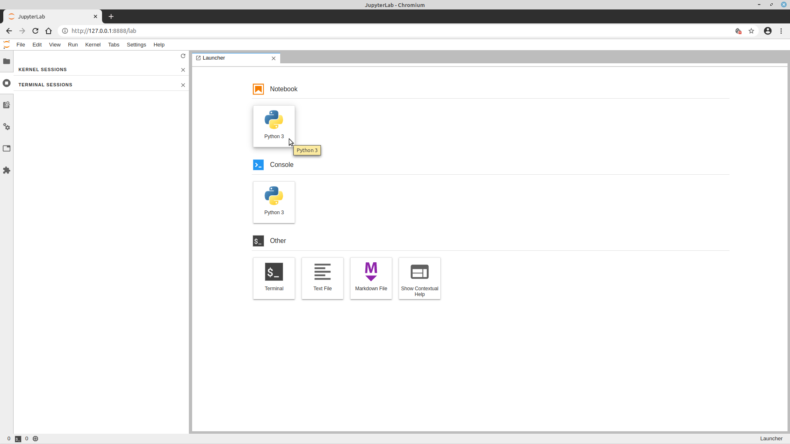
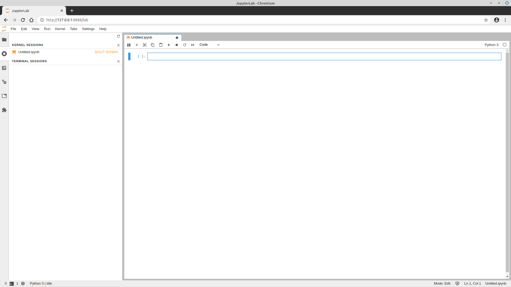
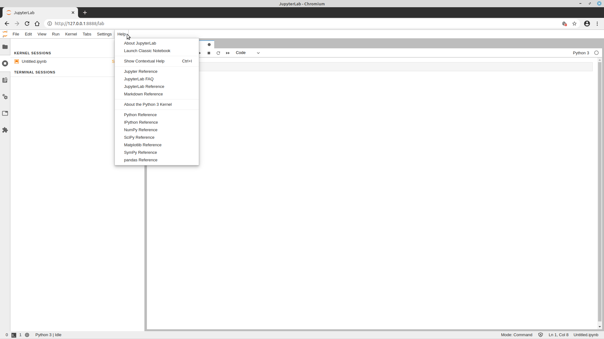
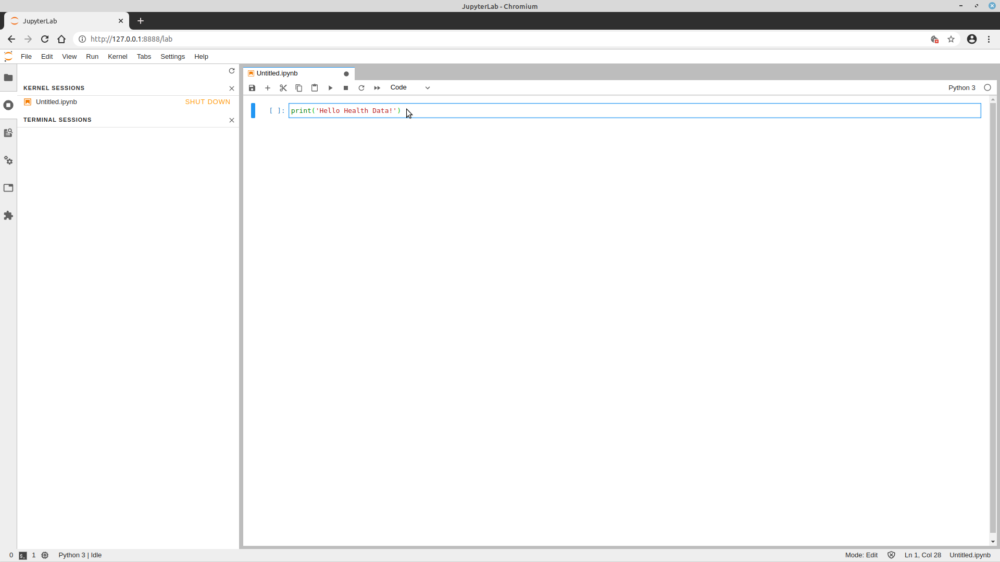
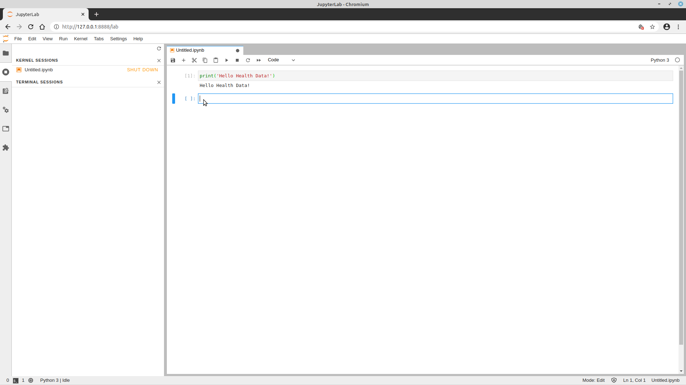
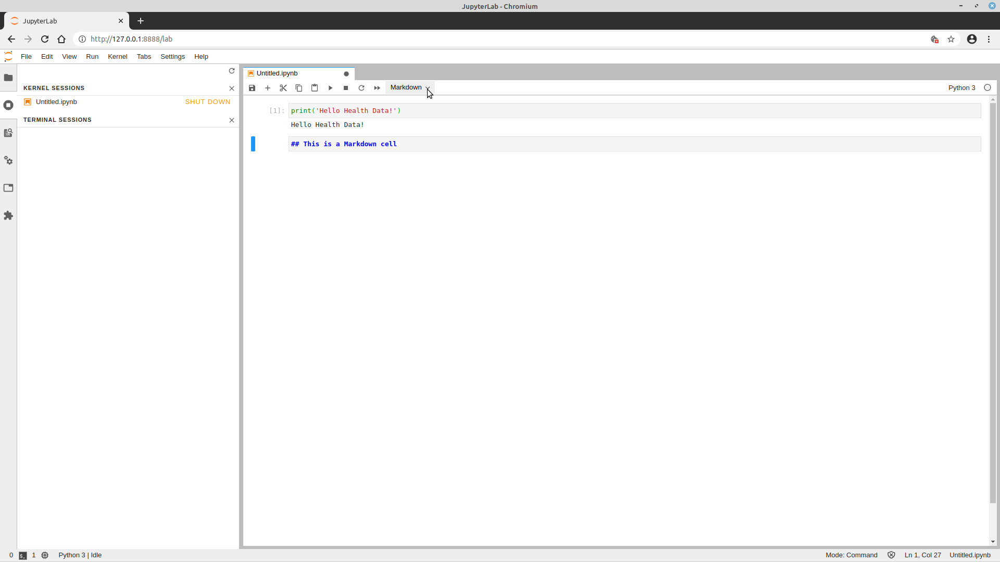
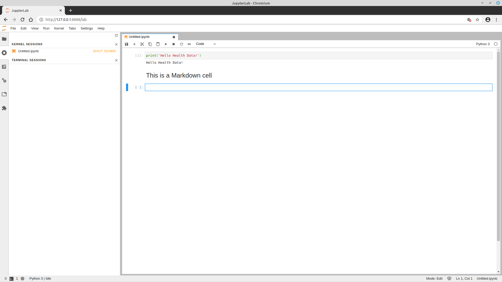
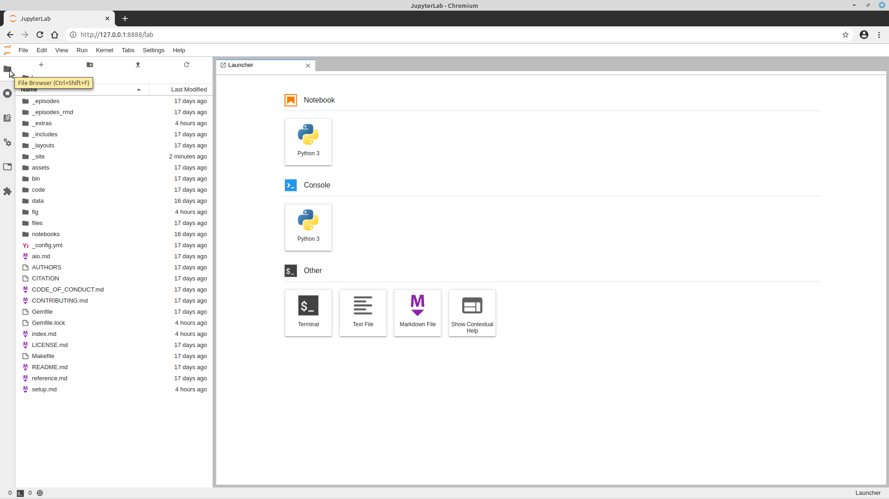

### JupyterLab Notebook examples

*Screenshots of example JupyterLab notebooks*

### How the JupyterLab notebook works

After typing the command 
~~~
jupyter-lab
~~~
{: .language-bash }

in your terminal window, the following happens:

* A JupyterLab notebook server is automatically created on your local machine.
* The JupyterLab notebook server runs locally on your machine only and does not
  use an internet connection.
* The JupyterLab notebook server opens the JupyterLab notebook client, also known
  as the notebook user interface, in your default web browser.
* When you create a new notebook and type code into it within the browser, the web browser and the JupyterLab notebook server communicate with each other.

*The JupyterLab Launcher*

To create a new Python notebook, click on the *Python 3* tile in the *Notebook* section on the Launcher tab

  
  *A new, blank Jupyter notebook*

Under the **Help** menu you will find guides on JupyterLab, Python, Markdown and some of the common Python packages we use in the Lesson.

  
  *Where to find help*

A JupyterLab notebook is made up of a number of cells which can contain code, Markdown, HTML, visualizations, and more.  
The JupyterLab notebook server does the work and calculations, and the web browser renders the notebook. The web browser then displays the updated notebook to you.  
For example, click in the first cell and type some Python code.

*A Code cell*

This is a **Code** cell (see the cell type dropdown with the word **Code**).  
To run the cell, type <kbd>Shift</kbd>+<kbd>Return</kbd>

*A Code cell and its output*

Let's look at a **Markdown** cell.  
Markdown is a text manipulation language that is readable yet offers additional formatting.  
Don't forget to select **Markdown** from the cell type dropdown. Click in the cell and enter the markdown text.

*A markdown input cell*

* To run the cell, type <kbd>Shift</kbd>+<kbd>Return</kbd>

*A rendered markdown cell*

### Workflow

The notebook workflow has several advantages:

- You can easily type, edit, and copy and paste blocks of code.
- Tab completion allows you to easily access the names of things you are using and learn more about them.
- It allows you to annotate your code with links, different sized text, bullets, etc. to make information more accessible to you and your
  collaborators.
- It allows you to display figures next to the code that produces them to tell a complete story of the analysis.

### How the notebook is stored

The notebook file is stored in a format called JSON and has the suffix `.ipynb`.  
Just like HTML for a webpage, what's saved in a notebook file looks different from what you see in your browser.  
But this format allows Jupyter to mix software code (in several languages) with documentation and graphics, all in one file.  

The user interface has a built-in file browser that you can access by clicking on the "folder" icon in the top left of the screen:

*A rendered markdown cell

### Notebook modes: Control and Edit

The notebook has two modes of operation: Control and Edit. Control mode lets
you edit notebook level features; while, Edit mode lets you change the
contents of a notebook cell. Remember a notebook is made up of a number of
cells which can contain code, markdown, html, visualizations, and more.

### Help and more information

Use the **Help** menu and its options when needed.
